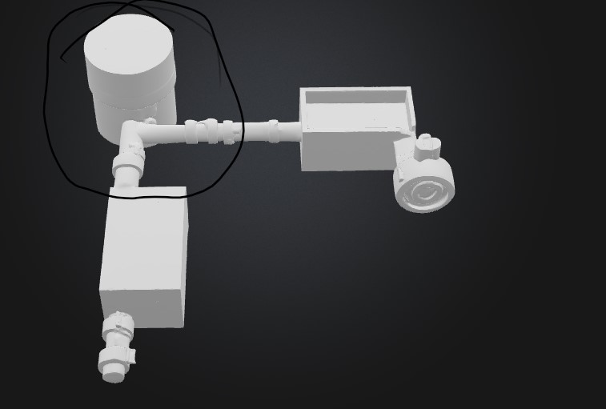
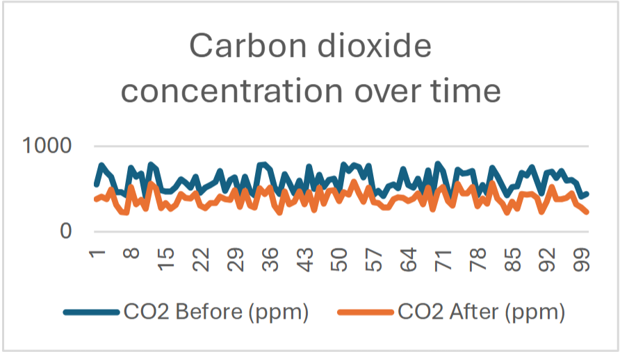
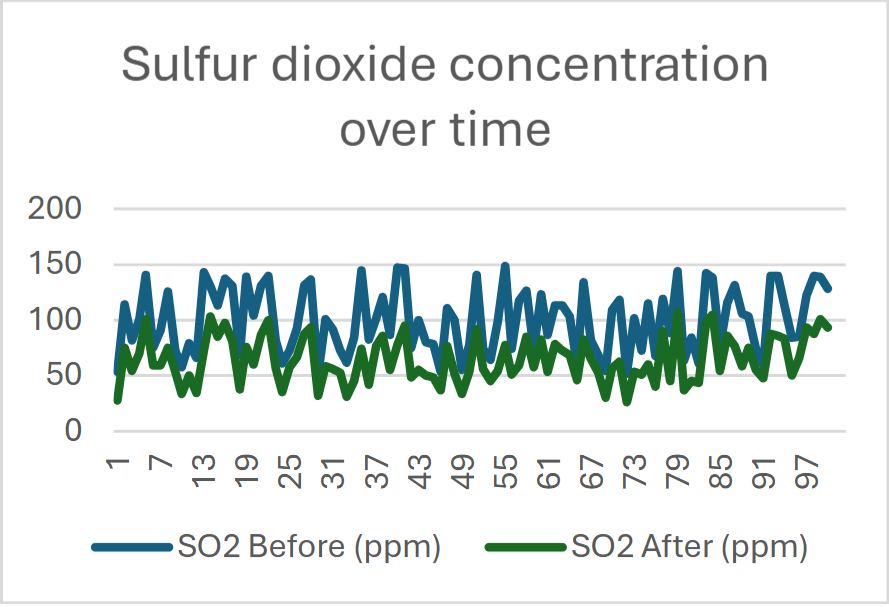
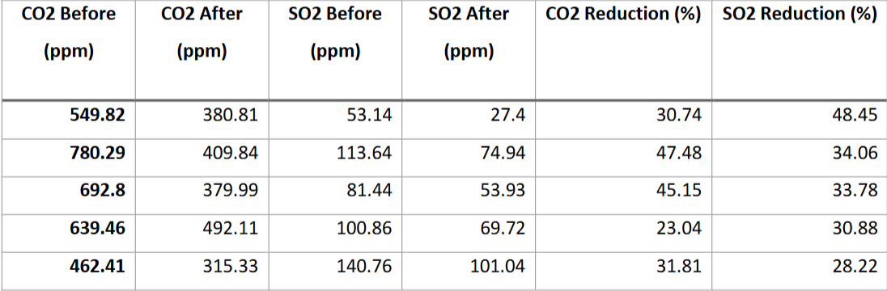
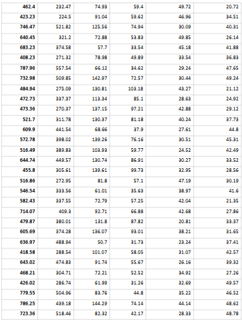
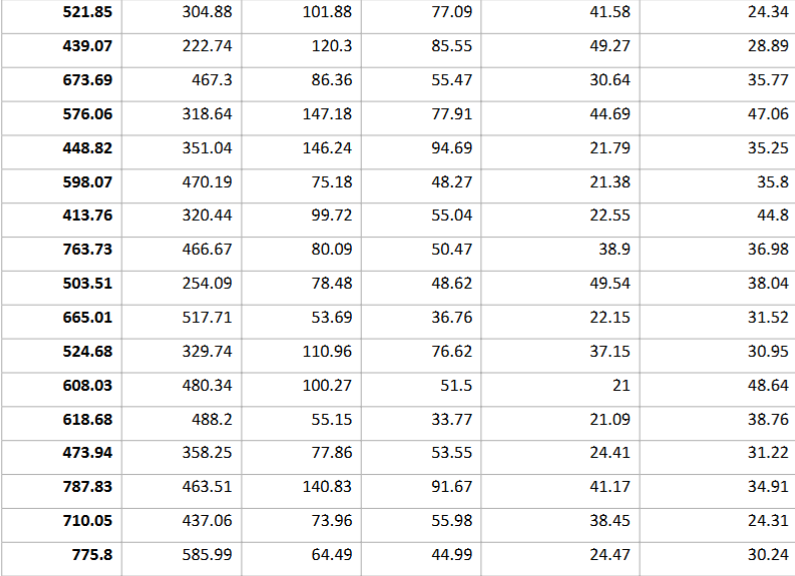
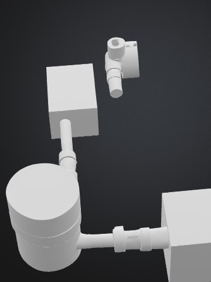
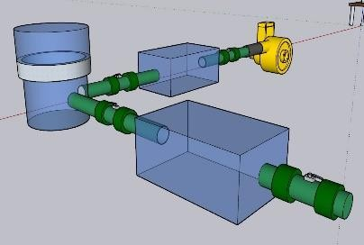
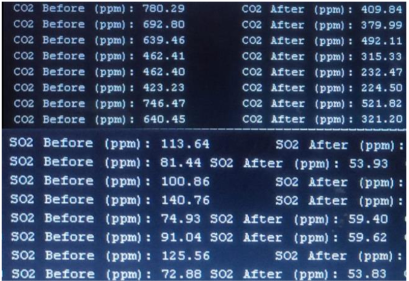
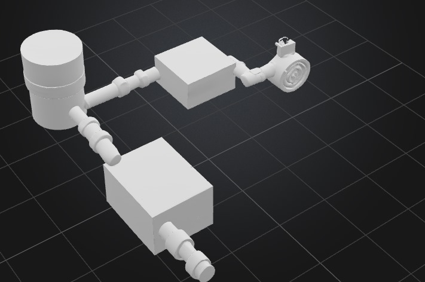

## Day 1 – Ideation & Problem Research (8 hours)  
**Date:** July 14  

I spent most of the day reading and thinking about Katameya’s Suez Cement Factory. I’ve passed by that place more times than I can count, and I always wondered how much the nearby neighborhoods are breathing in. That curiosity is what kicked off this whole project.  

I scribbled down a lot of rough ideas, honestly, some were silly, but the one that stuck was trying to trap CO₂ and SOx using something we throw away every day. While going down a rabbit hole of chemistry forums, I came across people talking about using eggshells to capture acidic gases. That caught my attention right away. It felt weirdly satisfying to imagine something so everyday and harmless helping solve something so toxic.  

I ended up reading about the calcium carbonate content of eggshells and how it can be turned into calcium hydroxide. Before calling it a night, I drew the very first rough system overview diagram to guide my later 3D work. It was messy, but it got the idea out of my head and onto paper.  

---

## Day 2 – Technical Research & Reaction Mechanisms (7 hours)  
**Date:** July 15  

Today was all about the chemistry. I dived deep into reaction equations, nothing fancy in terms of lab work, just me, my notes, and a lot of reference papers. I wanted to make sure the science behind my idea wasn’t just a “sounds cool” thing but actually worked in theory.  

The conversion of CaCO₃ (from eggshells) into Ca(OH)₂ through HCl treatment became my central process. I noted the reactions with acidic gases:
- `Ca(OH)₂ + CO₂ → CaCO₃ + H₂O`
- `Ca(OH)₂ + SO₂ → CaSO₃ + H₂O`  

It was kind of fun to compare this to limestone scrubbers and realize that in theory, this approach could be cheaper and more sustainable if sourced locally. I also began setting up the base structure for the 3D model, thinking about where these reaction chambers could realistically be placed. I found myself adding more detail than planned, maybe because I was picturing how it might actually sit next to a factory exhaust in real life.  

---

## Day 3 – Conceptual Design (7 hours)  
**Date:** July 16  

This was a creative day. I started sketching the system’s internal layers, and even though it’s just for my own project, I wanted it to look like something I’d be proud to show a friend.  

I broke it into layers:  
- **Layer 1:** Pre-filtration, maybe reusing mask filter material.  
- **Layer 2:** Neutralization chamber packed with Ca(OH)₂ sheets.  
- **Layer 3:** Airflow control to make sure gases pass evenly.  

While modeling this in 3D, I kept catching myself zooming in way too much to make small adjustments that nobody else will probably notice, but I guess that’s the fun of doing it for yourself.  

  

---

## Day 4 – Material Sourcing Simulation (7 hours)  
**Date:** July 17  

This was more like a thought experiment than anything else. I imagined the process of gathering eggshells from local bakeries and cafés and houeses, I even checked a few bakery websites just to get a sense of how many eggs they might go through in a week.  

From my notes, collecting 5 kg per week seemed totally doable, giving around 0.35 kg of usable Ca(OH)₂ per kg of shells. I mocked up a simple flow in the 3D model showing how these shells might be processed before entering the system. This was one of those sessions where I got so into it that I didn’t notice I’d been at the computer for hours without moving.  

---

## Day 5 – Chemical Conversion Protocol (7 hours)  
**Date:** July 18  

Even though I didn’t do any hands-on chemistry, I wanted to fully understand the lab steps. I wrote a clean protocol for converting shells into calcium hydroxide:  
1. Wash and dry shells.  
2. Treat with 1M HCl to form CaCl₂.  
3. Add NaOH to precipitate Ca(OH)₂.  

Running simulations on yields and reaction times helped me get a better picture of what the process would look like if it were real. At this point, I also started to imagine small details like labeling jars, storing powders, and keeping things organized, not because I needed to, but because it made it feel more “alive” in my head.  

### Expected Results & Analysis  

Here are the simulation outputs I generated:  

  
  
  
  
  

---

## Day 6 – System Assembly Design (7 hours)  
**Date:** July 19  

This was about arranging everything in a logical way. I designed a rectangular box layout in the model, adding in airflow paths and compartments.  

I decided on fans and seals for controlled airflow and even mocked up spaces for sensors like temperature and gas concentration readers. Even though I’m not building anything physical, it felt oddly satisfying to think about how someone *could* assemble it from these blueprints.  
  

---

## Day 7 – Poster Design & Presentation Prep (5 hours)  
**Date:** July 20  

This was a “visuals day.” I made a poster that showed how Calcify works, along with diagrams and an environmental impact chart. It was fun to arrange the elements in a way that felt neat but still casual. I wasn’t aiming for a pitch — just something that could explain my idea to anyone curious.  
  

---

## Day 8 – Testing & Iteration (8 hours)  
**Date:** July 21  

This was pure simulation work. I ran airflow models to see how the gas would interact with the Ca(OH)₂ sheets and adjusted the geometry for better flow.  

It was a bit like tweaking a video game level so everything moves just right, except here, it was for clean air. I also added an simualted “saturation sensor” to let the system know when it’s time to replace the neutralizing sheets.  
  

---

## Day 9 – Final Adjustments & Documentation (9 hours)  
**Date:** July 22  

The last stretch. I organized all my notes, models, and calculations into my tidy GitHub repo. I added reaction documentation. I also did one last review of the 3D model to make sure all parts aligned and looked coherent.  

Even though it’s just a personal project, seeing everything neatly documented gave me a sense of closure. It’s satisfying to think that if I ever wanted to share this idea with someone, it’s ready to go.  
  

---

