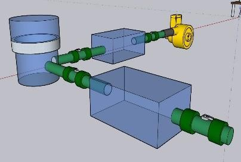
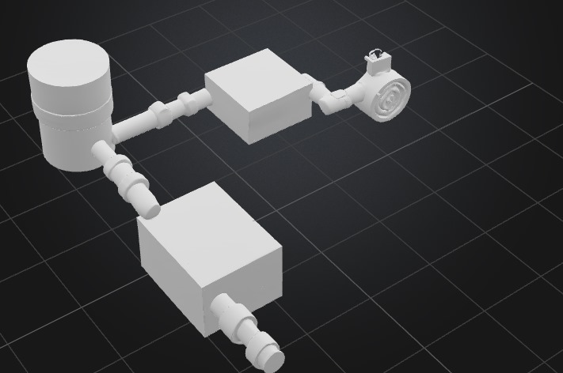
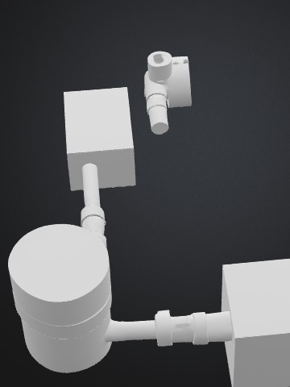
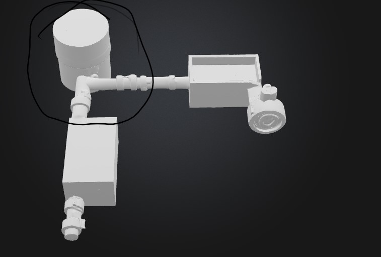
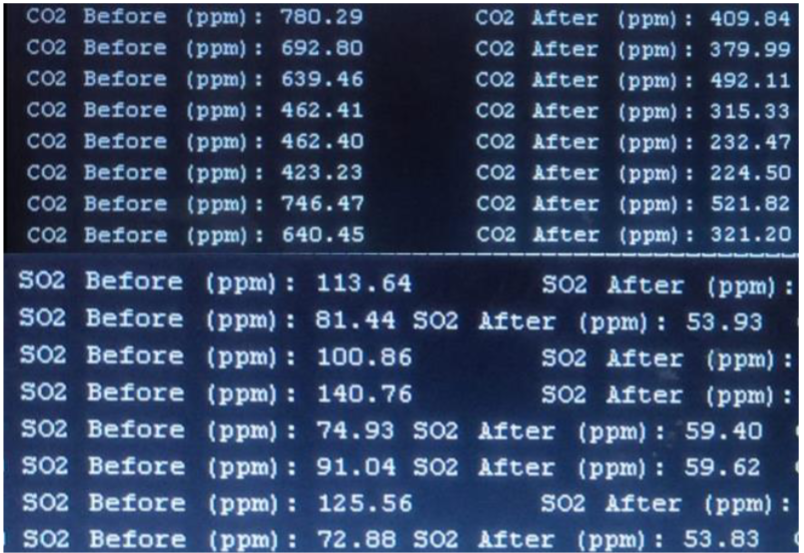
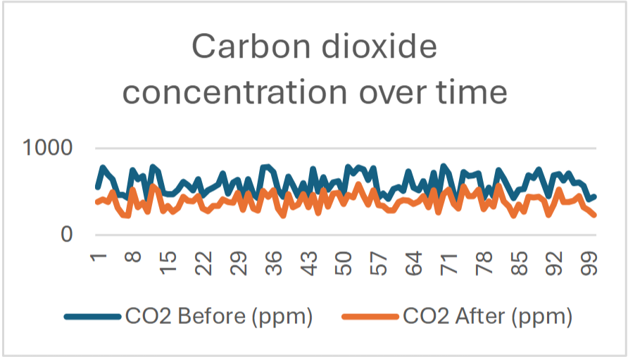
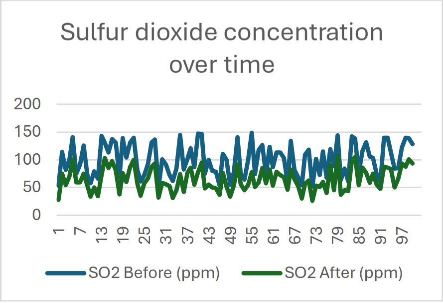
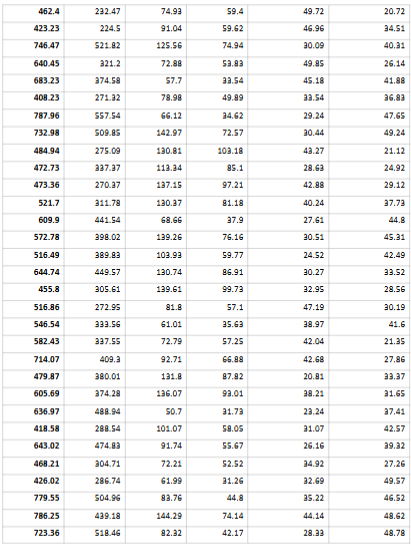
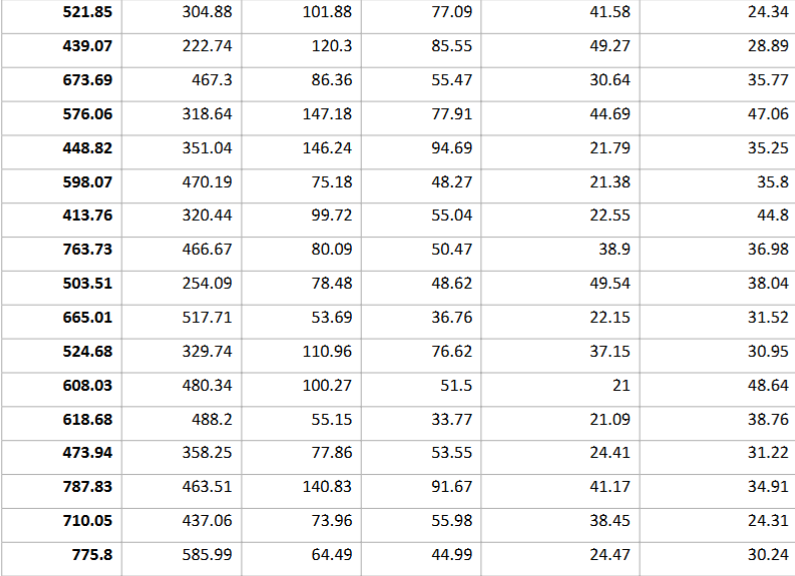

# Project Journal: Calcify  
---
title: "Calcify"
author: "Bakr Mohamed"
description: "This system provides a low-cost, green, and recyclable solution for reducing industrial emissions in areas close to residential neighborhoods."
created_at: "14/7/2025*"
Total Time Spent: 65 hours 

---

## Day 1 – Ideation & Problem Research (8 hours)  
**Date:** July 14  
- Discussed environmental issues related to Egypt’s industrial zones, focusing on Katameya’s Suez Cement Factory.  
- Brainstormed methods to mitigate CO₂ and SOx emissions using available local materials.  
- Discovered that eggshells (rich in calcium carbonate) could be repurposed into calcium hydroxide for gas neutralization.  
- Drafted a system overview diagram for the 3d model.

---

## Day 2 – Technical Research & Reaction Mechanisms (7 hours)  
**Date:** July 15  
- Studied chemical pathways for converting CaCO₃ from eggshells into Ca(OH)₂ via HCl treatment.  
- Modeled the expected reaction with acidic gases:  
  - `Ca(OH)₂ + CO₂ → CaCO₃ + H₂O`  
  - `Ca(OH)₂ + SO₂ → CaSO₃ + H₂O`  
- Compared efficiency to limestone scrubbers.  
- Begin the first steps of the 3d model on the cad model

---

## Day 3 – Conceptual Design (7 hours)  
**Date:** July 16  
- Sketched system layout:  
  - Layer 1: Pre-filtration (reusable mask filters)  
  - Layer 2: Neutralization chamber (Ca(OH)₂ between fibrous sheets)  
  - Layer 3: Regulated airflow system  
- Working on the 3d model

---

## Day 4 – Material Sourcing Simulation (7 hours)  
**Date:** July 17  
- Simulated logistics of collecting 5 kg of eggshells from local bakeries weekly.  
- Estimated average yield of Ca(OH)₂ per kg of shells: ~0.35 kg  
- Contacted hypothetical bakery chain for partnership simulation.  
- Working on the 3d model
 

---

## Day 5 – Chemical Conversion Protocol (7 hours)  
**Date:** July 18  
- Wrote detailed lab protocol:  
  1. Wash and dry eggshells  
  2. Treat with 1M HCl to release CO₂ and form CaCl₂  
  3. Precipitate Ca(OH)₂ using NaOH addition  
- Practiced process with simulated yields and reaction times.  
- Working on the 3d model

---

## Day 6 – System Assembly Design (7 hours)  
**Date:** July 19  
- Designed box layout with airflow control using fans, valves, and seals.  
- Incorporated Arduino sensor system for temperature and gas reading.  
- Discussed pressure and gas flow constraints.  
- Working on the 3d model

---

## Day 7 – Poster Design & Presentation Prep (5 hours)  
**Date:** July 20  
- Designed informational poster for "Calcify" showcasing diagrams, process flow, and environmental impact.  
- Working on the 3d model

---

## Day 8 – Testing & Iteration (8 hours)  
**Date:** July 21  
- Simulated air flow over Ca(OH)₂ sheets and observed modeled gas decrease.  
- Measured hypothetical output vs untreated exhaust.  
- Added feedback system for Ca(OH)₂ saturation detection.  
- Working on the 3d model

---

## Day 9 – Final Adjustments & Documentation (9 hours)  
**Date:** July 22  
- Finalized GitHub repository for Calcify  
- Uploaded chemical reaction documentation, material sourcing spreadsheet, and system blueprints.  
- Collected user feedback and summarized areas for improvement.  
- Finalized the 3d model.
- Final testing and calibration documentation.

---

## Summary Table  

| Date       | Tasks Completed                                | Hours |  
|------------|-------------------------------------------------|--------|  
| July 14    | Ideation & Problem Research                     | 8 h    |  
| July 15    | Chemical Research                               | 7 h    |  
| July 16    | Concept Design                                  | 7 h    |  
| July 17    | Logistics & Material Sourcing                   | 7 h    |  
| July 18    | Lab Protocol Writing                            | 7 h    |  
| July 19    | System Assembly Planning                        | 7 h    |  
| July 20    | Poster and Presentation                         | 5 h    |  
| July 21    | Testing & Iteration                             | 8 h    |  
| July 22    | Final Touches & Documentation                   | 9 h    |  
| **Total**  |                                                 | **65 h** |  

---

**Images:**  
 
 
 

simulated sensors readings:

expected results:

