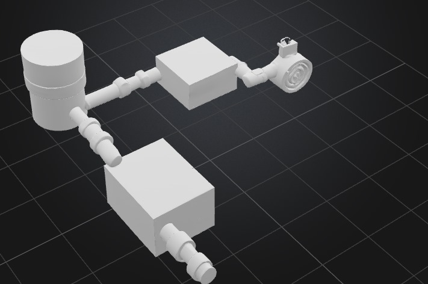

# Calcify

##  Project Description
This project targets industrial air pollution from the **Suez Cement Factory in Katameya**, one of Egypt’s largest cement producers. It provides a **sustainable and low-cost air purification system** that neutralizes harmful gases like **CO₂** and **SOx** using **recycled eggshells**.

Eggshells from nearby bakeries are chemically converted into **calcium hydroxide (Ca(OH)₂)** and placed into the system to neutralize acidic gases, producing harmless **CaCO₃ and CaSO₄** byproducts.

---

##  How It Works

### 1. **Pre-Filtration Layer**
- Reusable mask filters block large dust particles and debris.

### 2. **Neutralization Chamber**
- A fiber-sandwiched layer of Ca(OH)₂ reacts with acidic gases from the chimney exhaust.

### 3. **Airflow System**
- Controlled by **electric blowers**, **MQ-135 gas sensors**, and **electronic gas valves**. The flow is regulated through a Raspberry Pi 3B.

### 4. **Sustainability**
- Eggshell waste is repurposed using a chemical conversion process with **HCl**, reducing waste while producing effective neutralizers.

---

##  Project Images

 
 
 

---

##  Bill of Materials

| Component                         | Purpose                              | Estimated Cost (USD) | Link |
|----------------------------------|--------------------------------------|-----------------------|------|
| Raspberry Pi 3B Model B          | Controls the valve and sensor logic  | $75                  | [RAM Electronics](https://www.ram-e-shop.com/ar/shop/raspberry-pi-3-raspberry-pi-3b-model-b-7067) |
| Breadboard                       | Prototyping the control circuit      | $7.75                | [SparkFun](https://www.sparkfun.com/products/12615) |
| 4 Gas Valves                     | Control airflow between chambers     | $32                  | [eBay](https://www.ebay.com/itm/132272425835) |
| 4 MQ-135 Sensors                 | Detect harmful gases in air          | $8                   | [RAM Electronics](https://www.ram-e-shop.com/ar/shop/kit-mq135-mq-135-sensor-air-quality-sensor-hazardous-gas-detection-module-7312) |
| Hydrochloric Acid (HCl)          | Converts CaCO₃ (eggshells) to Ca(OH)₂ | $35                  | [Ubuy](https://www.ubuy.com.eg/en/product/1OOQRHUO-0-1m-hydrochloric-acid-1l-excellent-for-chemistry-or-refinement-experiments-the-curated-chemical-col) |
| Electric Blowers (x2)           | Pushes air through purification unit | $60                  | [Jumia](https://www.jumia.com.eg/ct17010-blower-and-vacuum-cleaner-710w-crown-mpg175087.html) |
| Plastic Jars & Boxes             | Gas containment & layering structure | $23                  | Local hardware/plastic supplier |
| Mask Layers (Reusable)           | Dust filtration layer                 | $7                   | Local pharmacy/hardware |
| Tubes & Connectors               | Air channeling and sealing           | $24                  | DIY store or plumbing supplier |
| Mesh Sheets                      | Holds Ca(OH)₂ in neutralization zone | $9                   | Fabric or construction supply |

**Total Estimated Cost: $280.75**
